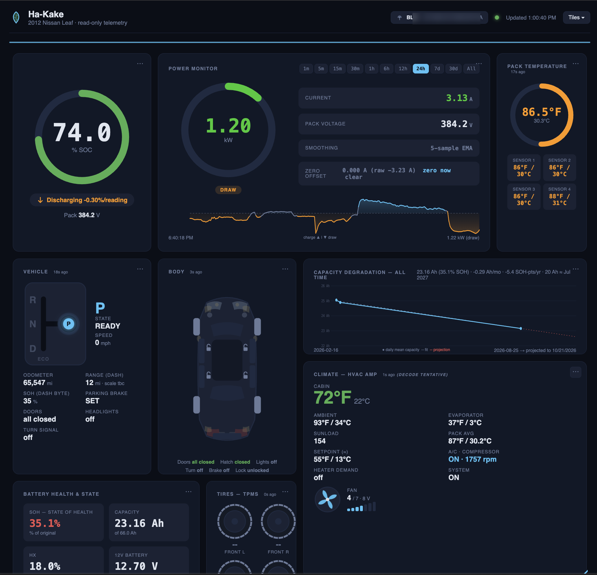
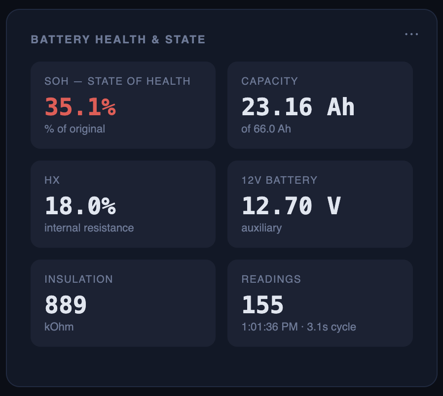
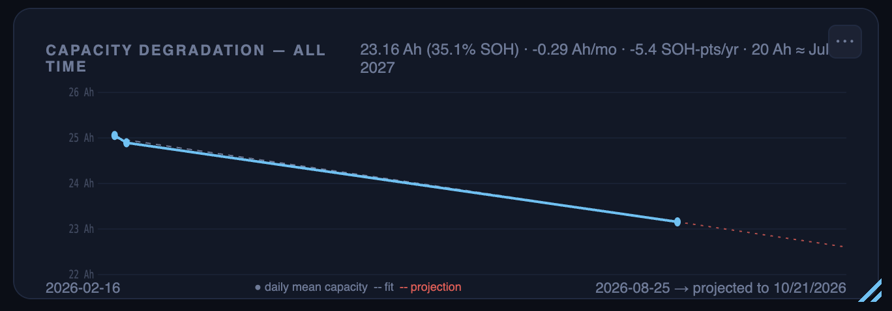
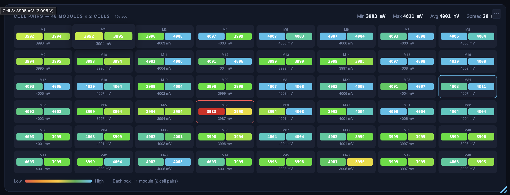
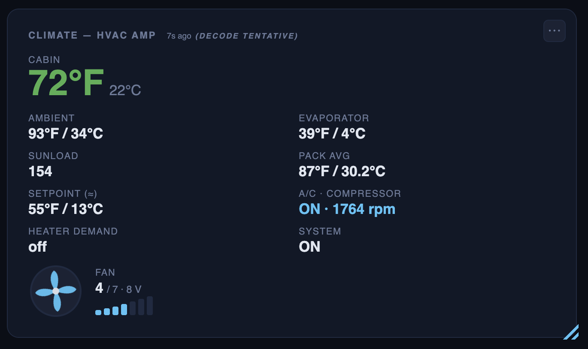
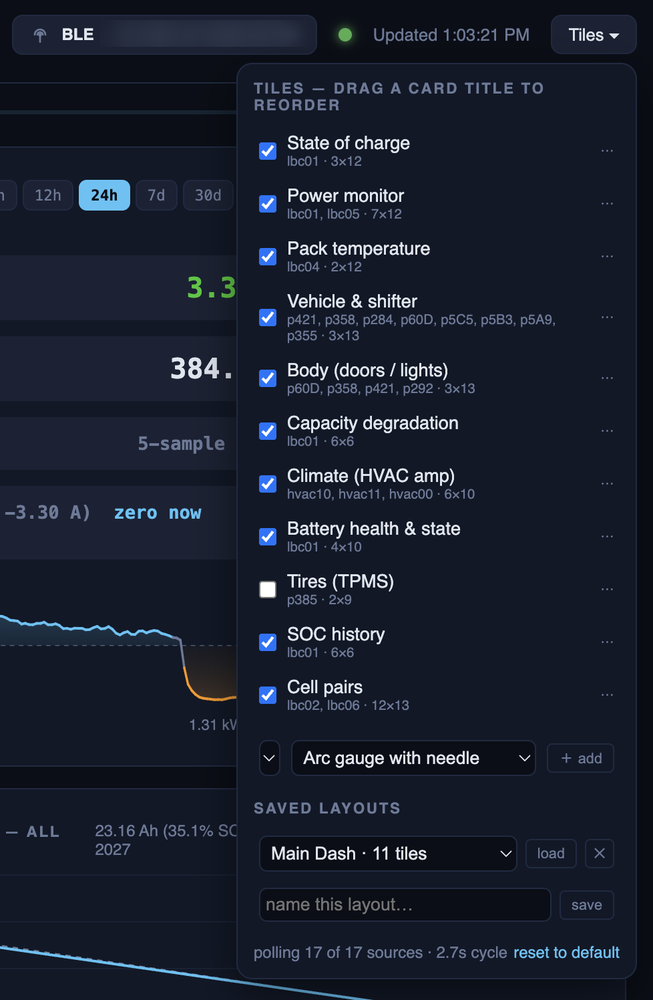
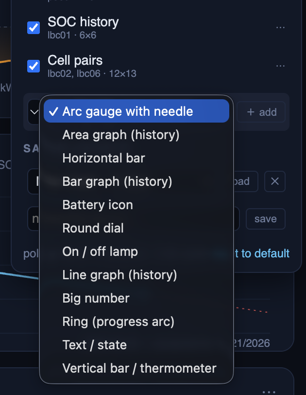

# Ha-Kake

A read-only telemetry dashboard for **any car with an OBD-II port**, read
through a cheap ELM327 adapter — BLE or USB — with a never-pruned SQLite
history so you can watch a vehicle age over months, not minutes.

It runs on a laptop in the passenger seat. No app, no cloud, no account,
nothing sent anywhere. It was developed on a 2011–2012 Nissan Leaf, where it
decodes far more than the OBD-II standard carries — battery state of health,
96 cell pairs, doors, locks, every exterior lamp, the climate amplifier — and
**the method used to find all of that is documented in full**, so you can do
the same on a car nobody has touched yet.

 

> ### ⚠️ Active development
>
> This is a working tool, not a finished product. It has been verified on
> **two cars** — a 2012 Nissan Leaf and a 2009 Mitsubishi Lancer. Expect
> breaking changes: file formats, the vehicle-profile contract, the API and
> the database schema all still move. Some decodes are marked *tentative* on
> purpose (see [`docs/SIGNALS.md`](docs/SIGNALS.md)), and a signal that is
> right on a 2012 Leaf may be wrong on a 2013 one. Read the numbers with the
> same scepticism the project applies to itself.
>
> ### ⚠️ Use at your own risk
>
> This is experimental software that talks to a car. It comes with **no
> warranty of any kind** — see sections 15 and 16 of the
> [licence](LICENSE), and understand that this is the plain-English version of
> them, not a softening.
>
> Three risks are worth naming specifically, because they are this project's
> and not generic:
>
> - **It is on a safety-critical bus.** It transmits requests, it can keep
>   modules awake, and a first-generation Leaf's 12 V battery is its most
>   common failure. See [Safety](#safety).
> - **The numbers can be wrong.** Some decodes are inferred from community
>   documentation and never verified on a car; those are labelled *tentative*
>   in [`docs/SIGNALS.md`](docs/SIGNALS.md), and the labelling is honest but it
>   is not a guarantee. A cheap ELM327 clone can also lie in ways this software
>   cannot detect.
> - **Do not make a money decision on these numbers alone.** A used Leaf's
>   value turns on its pack, and it would be entirely possible to buy or sell
>   one badly on the strength of a capacity figure from here. Confirm anything
>   that matters with a second tool or a dealer read before money moves.
>
> It is a diagnostic aid for people who like understanding their own car. It is
> not a substitute for a mechanic, and nothing here should be your only
> evidence for a repair, a purchase or a decision to keep driving.



## What it is, and what it is not

**It is** a passenger's instrument panel: it asks the car questions and draws
the answers. Everything it stores stays on your machine, forever, in one
SQLite file you can open with any tool.

**It is not** a driving aid, a scan tool that fixes anything, or a control
system. It is **read-only by design** — every service it sends is a read; no
write, control, routine or security-access service exists anywhere in the
project, and it will not clear your check-engine light. Read-only describes
what it asks for, not whether it is on the bus: it transmits requests like any
scan tool, and the Safety section says what follows from that. Do not operate the laptop while driving.
See [`SECURITY.md`](SECURITY.md).

## Any vehicle

The reader, scheduler, store, API and Tile Studio are vehicle-agnostic.
Everything car-specific — what to poll, how to decode it, what the dashboard
offers, which values get real database columns — lives in one module:
`vehicles/<profile>.py`.

Two profiles ship:

| Profile | Car | How it was built |
|---|---|---|
| `leaf_ze0` | 2011–2012 Nissan Leaf (ZE0) | Largely reverse engineered: 18 items, 57 signals, 33 history columns |
| `lancer_2009` | 2009 Mitsubishi Lancer ES | Standard SAE J1979 mode-01 PIDs — **no reverse engineering at all**: 19 items, 20 signals, 18 history columns, in 255 lines |

```bash
python web/app.py --adapter ble --vehicle lancer_2009
```

The Lancer is the proof that the seam is real, and the template for your car.
If your vehicle answers standard mode 01 — nearly every petrol car since the
late '90s — a profile is an afternoon's work: coolant, RPM, speed, load,
throttle, MAF, intake and ambient temperature, fuel level, 12 V system, plus a
read-only DTC readout (MIL lamp and stored/pending codes from modes 01/03/07 —
never mode 04, which clears them).

Built-in tiles like the car body and the cell grid are Leaf art; other profiles
start from a default layout of Tile Studio signal tiles, which work for any
profile. Set `"vehicle"` in `config.local.json` to make a choice permanent.

**→ [`docs/ADDING_A_VEHICLE.md`](docs/ADDING_A_VEHICLE.md)** — the contract,
the traps, and a worked example.

## No car? Run all of it anyway

You do not need a vehicle, an adapter, or a parking space to run this, develop
a profile for a car you do not own, or review someone else's.

```bash
python web/app.py --adapter replay                        # the Leaf
python web/app.py --adapter replay --vehicle lancer_2009  # the Lancer
```

**Replay** runs the whole real stack — reader, scheduler, transport, the
profile's own `configure()` and `decode()`, store, API, page — against a
recorded session in `tests/fixtures/`. It writes to its own throwaway database,
and every record it produces is flagged `replay: true`, so playback can never
be mistaken for a live reading. `record_session.py` records your own drive into
one. See **[docs/REPLAY.md](docs/REPLAY.md)**.

```bash
python web/app.py --adapter sim                           # a simulated car you can drive
```

**The simulator** is a *running model* rather than a recording: one command
starts the simulated car, the dashboard (`:5000`), the **cockpit** at `/sim` —
a page that looks like the car, where you press the start button, open a door,
press the pedal, turn on the heater or degrade a cell and watch the dashboard
react — and a control API on `127.0.0.1:8099` for scripts and agents
(`--no-sim-control` opts out; `--sim-control 0` takes a free port). Every value
it produces is labelled simulated, and it writes to its own throwaway database.
It lets you produce conditions no parked car will give you on request: a
collapsed cell pair, low isolation resistance, a sleeping ECU, a negative
response code. See **[docs/SIMULATOR.md](docs/SIMULATOR.md)**.

```bash
python hakake_sim.py --generate --days 180 --out /tmp/ui.db
python web/app.py --db /tmp/ui.db --no-reader   # months of history, for working on the charts
python web/app.py --demo                        # canned JSON, no reader at all
```

A simulator checks consistency, not truth — it would not have caught the
÷1024 bug — and the docs say so wherever it matters.

## Reverse engineering your car

**[`docs/reverse-engineering/`](docs/reverse-engineering/00-index.md)** is a
eight-chapter guide to finding signals nobody has published: getting on the bus
and past the adapter's quirks, narrowing to one CAN id, changing exactly one
physical thing, walking a control up and then back down, discrete inputs,
analog and scaled values, UDS and ISO-TP, what being wrong looks like, how to
record confidence honestly, and how a decoded byte becomes a tile.

None of the Leaf work in this repository came from a service manual. All of it
came from a $20 adapter, a parked car, and that method — and the method works
on anything with a CAN bus. The byte tables in
[`docs/SIGNALS.md`](docs/SIGNALS.md) are useful to a few thousand Leaf owners;
the method is the part that is useful to everyone.

## What it shows

The Leaf profile, as an example of how far a profile can go:

| Tile | Source | Refresh |
|---|---|---|
| State of charge, pack voltage, trend | LBC group 01 | every cycle (~2 s on BLE, faster on USB) |
| Battery health — capacity Ah, SOH %, HX, 12 V, insulation | LBC group 01 | every cycle |
| Pack temperature — 4 sensors, **°F / °C** | LBC group 04 | 15 s |
| Vehicle & shifter — gear (P/R/N/D/Eco), turn signals, speed, odometer, range, parking brake, dash SOH | Car-CAN passive | gear/turn every cycle, rest 2 s–5 min |
| Tires — four wheel profiles that scale with the card, colour-coded TPMS pressures | Car-CAN `0x385` | 20 s |
| Body — top-down car: per-corner doors + hatch, per-door locks, headlights/high-beam/parking/fog, turn signals + side repeaters, brake & reverse lamps | Car-CAN passive | doors/lights 3 s, turn/brake every cycle |
| Climate — cabin, ambient, evaporator temperature, sunload, **fan speed with a spinning fan** (blower volts), setpoint (≈), A/C + compressor rpm, heater demand, system on/off | HVAC amp UDS | 3 s |
| Power — signed kW / A with charge-vs-draw sparkline | LBC group 01/05 | every cycle (group 05 every 5 s) |
| SOC history — 1 min … 30 d … all | SQLite | |
| Capacity degradation — daily means, least-squares fit, projection | SQLite | |
| Cell pairs — 96 voltages, 48 modules, min/max/spread, balancing flags | LBC groups 02/06 | 20–30 s |

On an old EV the point of the tool is the battery — capacity, state of health,
internal resistance, the 12 V and insulation:



…and the trend that matters on an old pack:



Every one of the 96 cell pairs, colour-coded, with the weakest module flagged —
this is how you spot a pack going bad:



The body and climate are decoded too — doors, locks, every exterior light, and
the HVAC amplifier (cabin/ambient/evaporator, A/C compressor rpm, setpoint, fan):



**Tile Studio:** every card has a ⋯ menu — width, colour scale, min/max,
hide. The menu opens *over* the page rather than inside the card, so it stays
whole on a tile two columns wide: ⋯ opens and closes it, Escape closes it, and
a *Done* button sits in the foot (changes apply as you make them). *Tiles ▾ →
add* builds a new tile from any registered signal in
any style: big number, ring, arc gauge, dial, bar, thermometer, battery icon,
line / area / bar graph over history, text, lamp — each colour-encoded as the
value moves. **Grab a card's title to move it anywhere; grab the corner to
resize** — other tiles get out of the way (layout by the vendored
[gridstack.js](https://github.com/gridstack/gridstack.js), MIT). Save any
arrangement under a name from *Tiles ▾ → Saved layouts*, switch between
them, or reset to the default; every tile's ⋯ menu has *reset tile*. **A tile that is off is not
polled** — its bus time goes to the tiles you are looking at.





## Quick start

```bash
# One-time setup (Python 3.12; ≥3.10 required)
python3 -m venv venv
source venv/bin/activate
pip install -r requirements.txt

pytest -q                          # 730 offline tests, no car needed

# Dashboard (car IGN-ON or READY)
python web/app.py --adapter ble    # → http://127.0.0.1:5000
python web/app.py --adapter usb
python web/app.py --vehicle lancer_2009 --adapter usb
python web/app.py --no-reader      # dashboard only; run web/reader.py yourself
```

Adapter address: copy `config.local.example.json` to `config.local.json` and
set `ble_addr` (or export `HAKAKE_BLE_ADDR`; the older `LEAF_BLE_ADDR`
still works). Leave it empty and the reader
finds the first device named `OBDBLE` (`ble_name`). `scan_ble.py` lists what
it sees. `config.local.json` is gitignored — it identifies *your* adapter.

Console tools (with the venv active):

```bash
python battery_read.py --cells --store      # one full read, °C / °F, into the DB
python probe_hvac_carcan.py --adapter ble   # sweep Car-CAN IDs, HVAC amp, VCM
python gear_hvac_live.py gear 120           # print gear-byte transitions live
python calibrate_input.py fan               # step a control (fan 1→7→1), rank the bytes that follow
python calibrate_input.py body              # walk doors + locks (passive Car-CAN)
python calibrate_input.py lights            # walk parking / headlights / high beam / fog
python door_watch.py                        # live: print body-CAN bytes as you open/lock things
python record_session.py --seconds 60       # record a replayable session fixture
python vehicles/__init__.py                 # lint every vehicle profile against the contract
touch web/reader.pause                                # hand the adapter to a tool; rm to resume
```

## Hardware

- One ELM327 adapter on the OBD-II port. Tested with:
  - **LELink BLE** ("OBDBLE", ELM327 v1.5 clone) — wireless, ~2 s cycles
  - **obdiisoft USB** (CH340, ELM327 v1.5, HS/MS switch — leave it on **HS**)
    — a command round-trip is 5–10 ms, and the transport negotiates the link
    up from the ELM327's default 38400 to 115200 (`HAKAKE_SERIAL_BAUD=off` to
    stay at 38400). Measure your own adapter with
    `python tools/bench_transport.py`.
- macOS, Python 3.12 (tested on 3.12.13; ≥3.10 required). bleak + CoreBluetooth for BLE. Linux should work for USB; BLE untested.
- For the `leaf_ze0` profile: a 2011–2012 Leaf (ZE0). Later model years move
  offsets; see CONTRIBUTING. The car must be IGN-ON or READY for the LBC to
  answer.

Adapter quirks are handled in `elm327.py` (BLE writes need `response=True`;
ISO-TP needs `ATCAF1`; passive sniffing needs `ATCAF0`; always filter with
`ATCRA` or the clone overflows).

## Repository layout

| Path | Role |
|---|---|
| `elm327.py` | BLE + USB transport, adapter detection, ECU targeting, passive capture; replay and simulator transports |
| `vehicles/` | one module per car — items, targets, tiles, signal registry, `decode()`; `__init__.py` is the contract and its validator |
| `docs/ADDING_A_VEHICLE.md` | **the guide to adding your own car** |
| `leaf_decoders.py` | the Leaf's decoders: LBC groups 01–06, HVAC amp, Car-CAN frames |
| `signals.py` | registry machinery shared by every profile (colour scales, renderers, resolvers) |
| `web/static/tilestudio.js` | Tile Studio: per-tile menus, add-tile, renderers, drag-to-reorder |
| `docs/ADDING_SIGNALS.md` | **the six-step routine for decoding and wiring a new input** |
| `docs/reverse-engineering/` | **the eight-chapter guide to finding signals in any car** |
| `web/reader.py` | the only process that talks to the car — tile-driven scheduler, reconnect, pause |
| `tools/bench_transport.py` | developer tool: times adapter round-trips at several baud rates and models a full cycle |
| `battery_read.py` | console reader: one full read or a logging loop, °C / °F |
| `calibrate_input.py` | interactive input walker (fan / lights / doors / locks …) — how every signal was decoded |
| `probe_hvac_carcan.py` | one-shot probe: passive Car-CAN IDs, HVAC amp groups, VCM |
| `gear_hvac_live.py` / `door_watch.py` | live watchers: gear-byte transitions; body-CAN bytes as you open/lock |
| `scan_ble.py` | passive BLE scan to find your adapter |
| `web/store.py` | SQLite time series, downsampling, daily health, migration — schema built from the profile's `HISTORY_COLS` |
| `web/app.py` | Flask dashboard + API; supervises the reader subprocess |
| `web/templates/index.html` | the dashboard page (no framework); the four styled tiles are partials in `web/templates/tiles/`, painted by `web/static/tiles.js` |
| `record_session.py` | record a drive (or convert an old capture) into a replayable session fixture |
| `docs/REPLAY.md` | **running the whole dashboard with no car — replay mode and its fixtures** |
| `simulator/`, `hakake_sim.py` | the simulated car: model, load table, scenarios, encoder; the rig, control API and history generator |
| `web/templates/sim.html`, `web/static/sim.js` | the simulator cockpit (`/sim`), built on the dashboard's own tiles |
| `docs/SIMULATOR.md` | **the simulator: launch, the cockpit, the load model and its provenance, the control API** |
| `docs/SIMULATOR_CONTRACT.md` | what a simulator core must provide |
| `tests/` | pytest suite; `tests/fixtures/` holds real captured frames |
| `docs/SIGNALS.md` | **every decoded CAN ID and byte offset, with verification status** |
| `docs/ARCHITECTURE.md` | processes, scheduler, data model |
| `AGENTS.md` / `CLAUDE.md` | orientation for an AI agent; the working guide for this repo |
| `WORKLOG.md` | append-only session log — how each signal was found |
| `docs/ROADMAP.md` | roadmap |
| `scripts/privacy_sweep.py` | pre-push scan for personal / machine-specific data (wired as `.githooks/pre-push`) |
| `config.local.example.json` | copy to `config.local.json` (gitignored) for your adapter address |
| `research/` | local-only captures and notes — gitignored, never published |
| `legacy/` | superseded one-off scripts |

## API

| Route | Returns |
|---|---|
| `GET /api/status` | latest merged reading + `status`, `cycle_s`, per-item `item_age` |
| `GET /api/history?minutes=N` | downsampled readings (`N=0` → everything) |
| `GET /api/health` | one row per day: capacity, SOH, temps, spread, 12 V, insulation |
| `GET /api/cells?limit=N` | per-cell voltages for the last N full reads |
| `GET/PUT /api/tiles` | tile order, enabled, span, type, options, user tiles (drives what the reader polls) |
| `GET /api/signals` | signal registry, colour scales, tile types, items, tile defaults |
| `GET /api/layouts`, `PUT/DELETE /api/layouts/<name>`, `POST /api/layouts/<name>/load` | named layouts saved in `web/layouts.json` (gitignored) |
| `GET/PUT/DELETE /api/calibration` | per-car offsets (`zero_current`) in `web/calibration.json` (gitignored) |
| `GET /sim` | the simulator cockpit page (always renders; shows the launch commands when nothing is simulated) |
| `GET/PUT /api/sim/tiles` | the cockpit's own card layout in `web/sim_tiles.json` (gitignored) |

The simulator's own control API (`127.0.0.1:8099` by default, loopback only, no
authentication) is documented in [`docs/SIMULATOR.md`](docs/SIMULATOR.md).

## Contributing

Non-Leaf vehicles are especially welcome — the most useful first contribution
for a new car is a fixture capture. Start with
[`CONTRIBUTING.md`](CONTRIBUTING.md) and
[`docs/ADDING_A_VEHICLE.md`](docs/ADDING_A_VEHICLE.md).

### Before you push

```bash
git config core.hooksPath .githooks          # once per clone
python scripts/privacy_sweep.py --log 50
```

The sweep refuses home paths, device UUIDs, VINs, secrets and session URLs
in tracked files, and warns on e-mails, IPs and usernames. Personal captures
belong in `research/` (gitignored).

## Safety

**Read-only means the services it sends, not that it stays off the bus.**
Ha-Kake is an active participant on your car's diagnostic bus — it transmits
requests and reads the replies. It is not a passive tap.

What it sends, exhaustively: UDS service `0x21` group reads (the Leaf's battery
and HVAC controllers), OBD-II modes `01`, `03` and `07` (the Lancer's live data
and trouble codes — read-only; mode `04`, which clears codes, is never sent),
and ELM327 monitor mode, which is genuinely passive. The console probe tools
add read-identification services `0x22`, `0x1A` and mode `09`; one legacy
script sends `0x10` session control, which changes an ECU's diagnostic session
without writing anything. **No control, write, routine or security-access
service is sent anywhere in this project**, and pull requests adding one will
not be merged without a documented safety review (SECURITY.md).

Being on the bus at all has consequences worth knowing:

- **It can keep modules awake.** Polling a sleeping car stops parts of it
  going back to sleep, and a first-generation Leaf's 12 V battery is its most
  common failure. Do not leave the reader running for days on a parked car.
- **It adds bus traffic.** Small, but not zero, and you are sharing a
  safety-critical network.
- Use it only on a vehicle you own or are authorised to work on, and
  **do not operate the laptop while driving.** The dashboard is a passenger's
  tool.

## Status (2026-09-03)

- Verified on two cars: a 2012 Leaf SL at 35 % SOH (23.2 Ah), and a 2009
  Mitsubishi Lancer ES through the `lancer_2009` profile.
- 730 offline tests. BLE cycle ~2–3 s with every tile on; over USB a command
  round-trip is 5–10 ms and the cycle is dominated by passive `ATMA` dwell,
  not by the adapter (`tools/bench_transport.py` measures your own).
- **No car needed** (2026-09-03): replay runs the whole stack off a recorded
  fixture; the simulator runs it off a model with a provenance-labelled load
  table (READY idle, lamps and charge efficiency measured; A/C and heater
  from the owner's reports; motor and regen asserted until a logged drive),
  a cockpit page that looks like the car, and a control API for agents.
  One power identity — wall → charger → loads → pack — is summed in a single
  place, so the A/C draws while the car charges; twenty couplings are audited
  in `simulator/model.py` with a verdict each; the push-button start follows
  the 2012 manual. A simulator checks consistency, not truth — it would not
  have caught the ÷1024 bug — and says so.
- **Vehicle profiles** (2026-08-28): the reader, scheduler, store and Tile
  Studio are vehicle-agnostic; everything car-specific lives in
  `vehicles/<profile>.py`. The Lancer profile is standard SAE J1979 mode-01
  and needed no reverse engineering, plus a read-only DTC readout (MIL lamp
  and stored/pending/transmission codes from modes 01/03/07).
- **Decoded read-only over the BLE adapter:** SOC / capacity / SOH / 96 cells /
  pack temps / signed power; the full HVAC panel (fan speed, A/C + compressor,
  setpoint, heater, cabin / ambient / evaporator temps); gear (all 5), turn
  signals, TPMS, odometer, dash SOH; and the whole body — per-corner doors,
  hatch, locks, headlights, high beam, parking, fog, brake, reverse and side
  repeaters. Found with the interactive walker (`calibrate_input.py`).
- Tentative decodes (marked in `docs/SIGNALS.md`): compressor rpm, heater
  level, throttle / brake scale, range scale.
- Not reachable from this ECU set: HVAC vent mode / intake / AUTO, and all
  real-time EV-CAN data — both need the EV-CAN tap (re-pinned cable, pins
  13/12); VCM needs CONSULT / security access.

## License

**Code: [AGPL-3.0-or-later](LICENSE).** Free software — use it, modify it, run
it on your own car or in your own shop for money, no permission needed. If you
distribute a modified version, or offer one to others over a network, you must
publish your complete corresponding source under the same license.

**Documentation: [CC BY-SA 4.0](LICENSE-DOCS)** — everything under `docs/`,
including `docs/SIGNALS.md` and `docs/reverse-engineering/`. Quote it, translate
it, build on it; credit the project and share alike.

**Need to ship this in a closed-source product or a hosted service?** A
proprietary license is available — see [COMMERCIAL.md](COMMERCIAL.md).

Contributions are offered inbound under Apache-2.0 with a DCO sign-off
(`git commit -s`); see [CONTRIBUTING.md](CONTRIBUTING.md).

Bundled third-party code keeps its own license: gridstack.js (MIT) in
`web/static/vendor/`, credited in NOTICE. CAN identities were cross-checked against
the OVMS Nissan Leaf module and the `leaf_can_bus_messages` DBC collection
(credited in `docs/SIGNALS.md` and NOTICE). "Ha-Kake" and its logo are the
author's trademarks and are not licensed with the code; forks, please pick your
own name. Not affiliated with or endorsed by Nissan.
