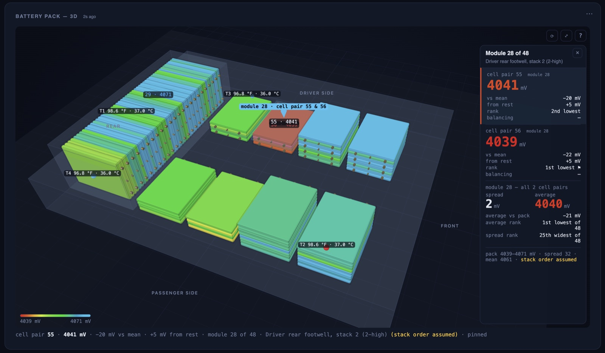

<!--
SPDX-FileCopyrightText: 2026 David D. Karnowski
SPDX-License-Identifier: AGPL-3.0-or-later
-->

# The 3D battery pack tile

> Tile **Battery pack (3D)** in the tiles menu (the card's own title reads
> *Battery pack — 3D*). Leaf profile only.

The cell-pair grid tells you *which* pair is low. This tile tells you *where*
it is: the pack drawn as it sits under the car — the tall block under the rear
seat, the flat stacks on either side of the floor — with every one of the 96
measured cell pairs as its own body, coloured by voltage, in a viewport you
can orbit, zoom and pan. Hover a pair for its value; click to pin it.

It follows the same `lbc02` cell read as the grid (every 20 s on the default
schedule), so the two panels always show the same frame. Under `--adapter sim`
put `fault.cell_degraded` on and one pair turns red; under `--adapter replay`
it follows the recording; under `--demo` it shows the demo frame.

## Colour scales (⋯ menu → *Colour by*)

| Scale | What `t = 0` (red) … `t = 1` (blue) means | Use it for |
|---|---|---|
| **absolute (grid scale)** (default) | the frame's lowest pair … its highest | Exactly the grid tile's colouring, so a pair is the same colour in both panels side by side. The slabs are lit so a top face shows its plain colour. **It rescales every frame**: red is whichever pair is lowest *now*, so in playback the meaning of a colour slides as the pack sags. |
| **fixed range** | a range that never moves: the profile's `fixed` bounds (3000 … 4200 mV on the Leaf), or the two numbers in the ⋯ menu | Watching a pull or a playback, where a colour must mean one voltage from the first frame to the last. Values outside the range clamp to the ends. The cost is contrast: at rest a healthy pack sits in a narrow slice near the top of the ramp and every pair looks alike, which is what the deviation scale is for. |
| deviation from the mean | −50 mV … +50 mV from the pack's mean at that instant | The weak-cell view. Under load every pair sags together; this shows who sags *more*. |
| drop from own rest value | −300 mV … 0 mV below the pair's first value this session (re-seeded when a playback window changes or the mode is switched) | A per-pair internal-resistance proxy during a drive log or playback. |

*Fixed range* in the menu sets the two bounds the fixed scale uses; leave them
blank for the profile's own. The cell grid carries the same two rows in its ⋯
menu, so both panels can be put on the same scale — each tile keeps its own
setting, so setting one does not move the other.

Other options: *Values* (label the lowest and highest pair, hover only, or
every pair), *Case* opacity, a view preset (iso, top, rear block, driver
side), *flash* — the lowest pair breathes toward white and the highest
toward blue so both can be found at a glance (on by default) — and *Flash
all below / above*: two voltages in mV; every pair under the first breathes
white and every pair over the second breathes blue, with the counts on the
readout line (blank for none). All of it persists in the tile's `opts` like
any other tile setting.

**The legend** under the viewport is a gradient bar with the active scale's
two ends written beside it — the frame's lowest and highest value on the grid
scale, the fixed bounds on the fixed one, ±the span on deviation. The bar is
always drawn red-low to blue-high: a mode with `invert` (temperatures, where
hot reads red) flips the *bodies* but not the bar, so on such a mode the
legend reads backwards. No shipped mode inverts, and `docs/PACK3D_GUIDE.md`
says so where it matters.

**In the viewport.** The four balls are the pack's temperature sensors
(T1–T4); each is coloured on the pack's own range — hottest red, coolest
blue — and labelled with its reading in °F and °C. Hover a pair or a sensor
for its readout on the line below; **click a pair** to pin its module — a
glowing box round the whole module, a pin bobbing above it and a label, so
it can be found from any angle — and open a side pane: both pairs of that
module, larger, each voltage in the colour the *currently chosen* scale gives
it, deviation
from the mean, drop from rest, rank in the pack (1st lowest ⚑, highest ▲),
whether the BMS is balancing it; then the module as a whole — its two pairs'
spread and average, large, with the average ranked among the 48 modules and
the spread ranked widest-first. **Click a sensor** for the same treatment:
its reading large and in its colour, °C, the difference from the pack mean,
its rank among the four, where it sits, and all four sensors listed. The
tile polls the temperatures (`lbc04`) for this. The corner tools: `⟳` auto-rotates,
`⤢` doubles the tile's height (a real resize, remembered with the layout),
`?` holds the pointer help. The bodies have the rounded edges of the real
module (6 mm).

## How the model is built

> To build one for another pack — a Prius NiMH, a pack with a temperature per
> module — see **`docs/PACK3D_GUIDE.md`**: the contract (`split`, `group`, modes,
> sensors), the method, a worked sketch.

There is no CAD file. `vehicles/leaf_ze0.py` carries the geometry as data —
`PACK_MODULE` (303 × 223 × 35 mm), `PACK_CASE` (the envelope: 1570 × 1188 mm
tray, 265 mm rear hump), `PACK_LAYOUT` (one entry per stack of modules) and
`PACK_SENSORS` (the four temperature sensors). `web/app.py` hands that to the
page, `web/static/pack_layout.js` turns it into 96 boxes (pure maths,
node-tested), and `web/static/pack3d.js` draws them with three.js: one
instanced mesh, one colour per instance, module outlines, terminal studs, a
translucent case, DOM labels tracked in 3D.

Each module is drawn as **two half-slabs split through its thickness**, one
per measured pair, because that is how the 2s2p module is built: the two
series pairs are stacked through it. The first pair of a module sits on the
upper (or, in the rear block, the passenger-side) half. The studs are drawn
on one **short** end of every module, as the real gen1 module has them —
inboard on the flat stacks, facing forward on the rear block, where a module
standing on edge is 223 mm tall and its short end looks down the bus-bar
channel.

three.js ships as ES modules only, so `pack3d.js` is the page's one module
script, reached through an import map that points at the vendored copy in
`web/static/vendor/three/`. Nothing loads from a CDN; the car has no internet.

## Where each cell pair is — and how sure we are

Indices are the dashboard's 0-based cell-pair numbers; the service manual (and
third-party apps) count the same pairs 1–96, which the tile shows as № n+1. The section-level layout is **verified against the ZE0
service manual, page EVB-20** (quoted by RegGuheert on mynissanleaf,
2013-04-29, for the 2011–2012 car; the full quote is in `docs/SIGNALS.md`,
"Cell order in the pack"): module n holds cells 2n−1 and 2n, and the modules
sit as follows.

| Where | Modules | Pairs | Confidence |
|---|---|---|---|
| Rear stack under the rear seat — 24 modules on edge in one row across the car, MD1 at the far passenger side, MD24 at the far driver side | MD1–MD24 | 1–48 | **verified** (EVB-20) |
| Rear driver's footwell — two 2-high stacks | MD25–MD28 | 49–56 | section verified; which stack is rearmost, and bottom → top, **assumed** |
| Under the front driver's seat — two 4-high stacks | MD29–MD36 | 57–72 | section verified; stack order **assumed** |
| Under the front passenger's seat — two 4-high stacks | MD37–MD44 | 73–88 | section verified; stack order **assumed** |
| Rear passenger's footwell — two 2-high stacks | MD45–MD48 | 89–96 | section verified; stack order **assumed** |

The stack heights (2-high in a footwell, 4-high under a seat) come from a
2013 pack teardown that describes the floor as "2-high packs of 4 and 4-high
packs of 8" per side, which is exactly what EVB-20's counts require. What
nobody has published is the order of the two stacks inside a group and the
bottom-to-top order within a stack; the tile draws the string as one loop
(driver side rear → front, passenger side front → rear, bottom → top) and
shows *(stack order assumed)* in its readout for those pairs. Every
`PACK_LAYOUT` entry whose order is still assumed carries that note in its
`verify` field; the rear block's is empty, because EVB-20 settles it; when the EVB-20 figure or a look
under the seat settles it, moving a stack is a data edit, not a code change.

## Reading it under load

At rest a healthy pack is one colour. The interesting picture is during an
acceleration: a pair with higher internal resistance sags more than its
neighbours and shows up on the *deviation* scale while the current is
flowing, then recovers. The default 20 s cell cadence rarely catches that.

**Cell log** (⋯ menu of this tile or the cell grid → *read the cell voltages
every cycle and store every read*): the reader moves the cell read into the
fast lane and stores a row for every fresh read, and the header shows a CELL
LOG badge while it is armed. Cost: on BLE the read is ~1.3 s a cycle, on USB
well under half a second, and the database grows by 96 cell rows a cycle —
turn it off after the drive. Then open playback (`docs/PLAYBACK.md`), pick the
drive, drag the strip to the current spike, and step through it. A passenger
runs the laptop; the driver drives.
