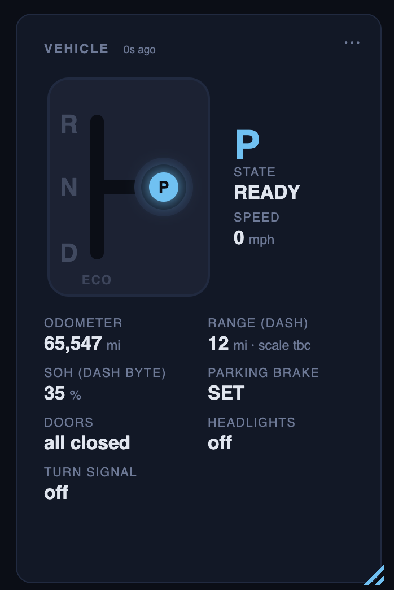

# Decoded signals

Everything the project knows how to read, where it comes from, and how sure
we are — one section per [vehicle profile](../vehicles/__init__.py).
**Verified** = observed changing with the physical input on this car.
**Static** = decoded from a static capture whose value passed an external check
(matches the dash, the LBC, or a plausibility bound) but has not been observed
changing. **Tentative** = from community documentation or an unchecked sample.

Sign convention: current is **negative while discharging**, positive while
charging/regenerating; `power_kw` uses the same sign. Temperatures are stored
in °C and always presented with °F.

Where a signal lives in code: the decode belongs to the profile
(`vehicles/<profile>.py`, the Leaf's byte work in `leaf_decoders.py`), the
label/unit/range in that profile's `SIGNALS`, and — if it is to be charted or
aggregated — a column in its `HISTORY_COLS`. See `ADDING_SIGNALS.md`.

## 2012 Nissan Leaf (ZE0)

### Transport facts (all adapters)

| Fact | Detail |
|---|---|
| Protocol | `ATSP6` — ISO 15765-4 CAN, 11-bit, 500 kbit/s (Car-CAN, OBD pins 6/14) |
| Standard OBD-II PIDs | Not implemented by the Leaf (`0100` → `NO DATA`) |
| UDS to the LBC | `ATSH 79B` / `ATCRA 7BB` / `ATCAF1` / `ATFCSH 79B` / `ATFCSD 30 00 20` / `ATFCSM1` — the VCM bridges Car-CAN ↔ EV-CAN for these |
| Passive sniffing | **must use `ATCAF0`**; with `ATCAF1` most raw frames print as `<DATA ERROR` |
| Buffer | Unfiltered `ATMA` overflows (`BUFFER FULL`) within ~24 frames; always filter with `ATCRA` |
| EV-CAN (pins 12/13) | Not reachable with the standard 6/14 pinout — `0x1DB`, `0x55B`, `0x5BC`, `0x54C`, `0x54F` etc. are not visible; see "Not reachable without EV-CAN" for the re-pinned-cable route |
| BLE quirk | LELink needs `response=True` on every write or no notifications arrive |

### LBC / BMS — UDS `0x79B → 0x7BB`, service `0x21`

Offsets are 0-based into the payload after `61 NN`.

#### Group 01 — battery state (39 B) — verified

| Bytes | Field | Scale |
|---|---|---|
| 0–3 | HV current sensor 1 | s32 ÷ 1024 A |
| 6–9 | HV current sensor 2 | s32 ÷ 1024 A (**checked to −66 A on the 2026-09-03 drive**: it agrees with group 05 to a median 0.27 A below ±32 A and with group 05's aliased value above it, and coulomb-integrating it over the whole 964 s drive accounts for 96 % of the charge the BMS's own SOC × capacity says left the pack — the 4 % shortfall is the expected under-count from trapezoid integration of a spiky trace sampled every 5–6 s. `s32` has no ceiling and this drive found none) |
| 18–19 | **Pack voltage** | u16 ÷ 100 V (matches 96-cell sum within 0.1 V) |
| 20–21 | 12 V battery | u16 ÷ 1024 V |
| 22–23 | Insulation resistance | kΩ |
| 26–27 | HX | u16 ÷ 100 |
| 29–31 | SOC | u24 ÷ 10000 % |
| 33–35 | Capacity | u24 ÷ 10000 Ah (SOH = ÷ 66 Ah) |
| 4–5, 24–25 | unknown, static (`0x0287`, `0x00F2`) | — |

**Current-sensor behaviour (2026-08-24):** all three current sources — group-01
sensors 1 and 2 and group 05 — wander ±0.5 A around zero at idle, and the
group-05 discharge flag follows the noise; sensor 1 is coarse (±2 A steps).
Under a 500 W load sensor 2 and group 05 agree within 0.05 A. The reader fuses
sensor 2 (every cycle) with a learned offset to group 05 (every 5 s), applies
the per-car zero calibration, and clamps positive current while the BMS reports
discharging; the dashboard treats |I| < 0.6 A (|P| < 0.25 kW) as idle.

#### Group 02 — cell pair voltages (192 B of cell data; the ISO-TP parse pads to 200 B) — verified
96 × u16 mV, `0xFFFF` padding after the last cell.

#### Group 03 (32 B) — tentative
Bytes 10–11 cell max mV, 12–13 cell min mV. Rest unknown.

#### Group 04 — temperatures (18 B) — verified
4 × (u16 raw, s8 °C); byte 12 looks like the mean.

#### Group 05 — extended state (74 B) — verified
| Bytes | Field | Scale |
|---|---|---|
| 6–7 / 8–9 | cell max / min | mV |
| 10–17 | temperature raws (as group 04) | |
| 20–21 | discharge flag | `0xFFFF` = discharging |
| 22–23 | pack current | s16 ÷ 1024 A, **and it aliases**: the same count group 01 reports, truncated to 16 bits, so a true current outside ±32.0 A folds back by 64 A (resolved 2026-09-03; see below) |
| 24–25 | insulation | kΩ |
| 26–45 | segment deltas ×10 | u16, `0xFFFF` padding |
| 46–65 | cell-group voltages ×10 | u16 |

**Group-05 current wraps — resolved 2026-09-03.** The question raised on
2026-09-02 (a signed 16-bit field ÷ 1024 saturates at ±32.0 A, yet the car
draws far more than that) is answered by the 13-minute drive of
2026-09-03 21:45–21:59 UTC: 171 rows, 92 fresh group-05 samples, group-01
sensor 2 reaching −66.5 A. Of the four shapes the capture plan named — linear
past 32 A, wraps, clamps, or a wrong slope — **it wraps**. The scale is a
plain `s16 ÷ 1024`; there is simply no wider field and no clamp, so a true
current outside ±32 A comes back folded by 64 A, sign and all.

The evidence, comparing each fresh group-05 sample against group-01 sensor 2
(`lbc01` is period 0, `lbc05` period 5, so the two reads are ~0.5–1 s apart;
every hypothesis was allowed the same best-of-three choice among the
neighbouring sensor-2 reads):

| hypothesis | median error, samples above ±32 A (n = 21) |
|---|---|
| linear (group 05 = sensor 2) | 8.49 A |
| clamps at ±32 | 8.49 A |
| a different slope (half scale) | 11.88 A |
| **wraps (16-bit aliasing)** | **2.50 A** |

2.50 A is the measurement's own resolution, not a residual: in-band samples
taken under the same fast transients (>15 A of slew across the three-row
window) disagree by a median 1.80 A for purely timing reasons.

*Clamping is falsified outright.* Of the samples whose neighbourhood exceeded
40 A, **none** sat at the rail; only 4 of 169 samples fall in the 30–32 A bin
at all and the distribution of |current| is smooth right up to it. The
largest magnitude ever seen was 31.919 A, and the field changes sign as it
crosses the rail — at sensor-2 −34.11 A group 05 read **+31.71 A**, where a
clamp would give −32, linear −34 and a half scale −17. Two more, taken while
current was changing slowly: sensor 2 −47.50 A → group 05 +15.57 A (folded
+16.50); sensor 2 −41.13 A → +23.58 A (folded +22.87).

*Below the rail the published scale is right.* Restricted to fresh samples
where sensor 2 moved less than 3 A across the three-row window (n = 25,
|I| ≤ 30 A), group 05 and sensor 2 agree to a median 0.27 A, worst case
1.43 A, with a fit of `g05 = 0.956·s2 − 0.199` (R² = 0.995 — a consistency
check between two reads of one quantity, not a calibration).

**What this means for the reader.** `apply_policy()` treats group-01 sensor 2
as canonical, which is the right choice and needs no change. But it also
learns `s2_offset = group05 − sensor2` on every fresh group-05 sample and
carries it between samples — and above ±32 A that difference *is* the wrap
error. Over this drive the fused `current_a` strays from sensor 2 by a median
5.9 A, p90 23.6 A, worst 41.1 A while moving; the `discharging and cur > 0 →
0.0` clamp then zeroes many driving rows outright. The offset should only be
learned while |group 05| is comfortably inside the band and the two reads are
close. Open; not fixed in this pass.

Also open, from the same drive: group-01 sensor 1 reads a median **1.358×**
sensor 2 under load (p10 1.294, p90 1.429, n = 48 above 15 A), and it is
sensor 2 that coulomb-counts correctly against SOC. Sensor 1 is not simply
"coarse"; its scale or its meaning is wrong. Unresolved.

Related, from the earlier capture: group 05's cell max/min (3965/3953 mV) disagree with
group 02's (4011/3981 mV) in `tests/fixtures/lbc_raw_20260824.json`. Either
they are sampled at different instants or one pair is a different field.
Unresolved; group 02 is the one the dashboard uses.

#### Group 06 — balancing (25 B) — tentative
24 data bytes = 192 bits = 2 bits per cell pair; non-zero appears to mean the
pair is being bled. Needs a charge session to confirm.

### HVAC amplifier — UDS `0x744 → 0x764`, service `0x21`

Full service-21 sweep (2026-08-24): only **00** (4 B `80 01 80 00`), **01**, **10**, **11**, **82** (DTC-style, mostly `FF`) and **83** (ASCII part number) answer; everything else → NRC `0x12`; service `0x22` → NRC `0x11`. Intake (fresh/recirc) walks moved nothing in 10/11/01 — the intake door is not exposed there.

#### Group 10 (41 B declared; the parse pads to 46 B) — tentative
| Byte | Field | Scale | Sample (AC on, evening) |
|---|---|---|---|
| 0 | ambient | raw − 40 °C | 33 °C / 91 °F |
| 1 | **in-car (cabin)** | raw − 40 °C | 21 °C / 70 °F |
| 2 | intake / evaporator | raw − 40 °C | 1 °C / 34 °F |
| 3 | sunload | raw | 2 |
| **10** | **bit 7 = A/C compressor on** | `00` ↔ `80` | **verified** (A/C walk off/on/off/on/off) |
| **11** | **blower: bit 7 = HVAC/fan on, bits 0–6 = motor volts** | fan 1–7 → 4 5 6 8 9 11 **11** V; HVAC OFF → `00` | **verified** (fan walk 1→7→1, on/off walk). Speeds 6 and 7 both read 11 V — indistinguishable here (the decoder's 12 V → speed-7 slot has never been observed on this car); the tile shows "6–7" |
| **12** | **air-mix target ≈ setpoint**: °F ≈ 60 + (raw − 111) × 30/62 | 111…173 for 60…90 °F, 1–3 counts lag coming down | verified proxy (setpoint walk 60→90→60) |
| 21–22 | compressor speed, u16 rpm | 1600–2425 with A/C on, 0 off | tentative |
| 23–26 | two u16 words (`hvac_w23`, `hvac_w25`) that scale with compressor rpm (power / current?) | | unresolved |
| 29, 31 | non-zero only while heating (`18 00 03` at 90 °F) — heater A / kW candidates | | unresolved |
| **36** | **heater demand level** | 0 at 60–65 °F, 3 → 40 as the PTC works | tentative |
| 38, 39 | `00` HVAC off · `36` on · `64`–`6E` after A/C or defrost | | unresolved |

**Not readable from this ECU (walked, nothing moved in 00/01/10/11):** vent
mode (4-position cycle, twice), AUTO, fresh/recirc. OVMS reads those from
EV-CAN `0x54B` (fan, vent mode, intake) — needs the re-pinned cable.

Group 11 (11 B) and group 01 (11 B) are captured raw; not yet decoded.

### Car-CAN passive frames (capture with `ATCAF0` + `ATCRA <id>`)

| ID | Bytes | Field | Decode | Status |
|---|---|---|---|---|
| `0x421` | b0 | **Gear** | `08` P · `10` R · `18` N · `20` D · `38` Eco | **verified** (all five, 2026-08-24) |
| `0x174` | b3 | Gear (coarse) | `AA` P/N · `99` R · `BB` D/Eco | verified — cannot split P/N or D/Eco; not polled (`0x421` is used) |
| `0x358` | b2 | **Turn signals** | `80` off · `82` left · `84` right · `86` hazards | left/right **verified** (2026-02 capture); `86` hazards tentative — community value, never captured on this car |
| `0x385` | b2–5 | **TPMS** | psi = raw ÷ 4, order FL FR RR RL | static — plausible pressures; < 5 psi = sensors asleep |
| `0x5C5` | b1–3 | **Odometer** | u24 in dash units (see `0x355`) | static — matches the dash (65,545 mi) |
| `0x5C5` | b0 bit 2 | Parking brake | | static (only 'set' observed) |
| `0x355` | b6 bit 5 | Units | 1 = miles | static |
| `0x5B3` | b1 | **SOH (dash)** | (b1 >> 1) % | static — matches the LBC (35 %) |
| `0x60D` | b0 | **Doors (per corner)** | `08` driver · `10` passenger · `20` rear-L · `40` rear-R · `80` hatch · bit1 headlights | **verified** (door walk 2026-08-25) |
| `0x60D` | b2 | **Locks** | `18` locked · `00` unlocked | **verified** (lock walk) |
| `0x60D` | b1 bits 1–2 | Start state | 0 off · 1 acc · 2 on · 3 ready (`06`→ready) | tentative |
| `0x284` | b4–5 | Speed | ≈ raw ÷ 100 km/h | tentative (only 0 observed) |
| `0x5A9` | b1–2 | Range (guess-o-meter) | (u16 >> 4) ÷ 5 km | tentative — scale unconfirmed |
| `0x180` | b5 | Throttle | ÷ 2 % | tentative; decoded but not yet polled by the reader |
| `0x292` | b6 | **Brake pedal / brake light** | `brake_on` = b6 > 0 | tentative |
| `0x60D` | b0 | **Lights:** `0x04` parking · `0x02` low beam | | **verified** (lights walk 2026-08-25) |
| `0x60D` | b1 | **Lights:** `0x08` high beam · `0x01` fog | (bits 1-2 are start-state) | **verified** |
| `0x625` | b1 | Light-level bitfield: `0x40` park · `0x20` low · `0x10` high · `0x08` fog | mirrors 0x60D | observed in walks; not decoded — the dashboard uses `0x60D` |
| — | — | Reverse lights | derived from gear = R (`0x421`) | derived |
| — | — | Turn / side repeaters / hazards | driven by `0x358` (front+rear+side, same side) | left/right verified; hazards tentative |
| `0x260` | — | Available power (53 kW drive / 5 kW regen) | | observed 2026-02 |
| `0x1D5` | — | Torque | | observed 2026-02 |

### Other ECU probes

| ECU | Address | Result |
|---|---|---|
| VCM | `0x797 → 0x79A` | NRC `0x80` for every `0x21`/`0x22`; `0x1A`/`0x09` → NRC `0x11`. Needs a CONSULT session / security access. Parked. |
| Inverter | `0x793 → 0x7BD` | no response |
| Steering | `0x746 → 0x766` | no response |
| ABS, BCM, EPS | `0x743`, `0x745`, `0x784` | respond to group 01; not yet decoded |

### Not reachable without EV-CAN

**EV-CAN is on the OBD-II port of the 2011–2017 Leaf** (confirmed against the
OVMS ZE0 cable pinout and the sethfischer Leaf OBD manual, 2026-08-25):

| OBD-II pin | Signal |
|---|---|
| 6 / 14 | Car-CAN H / L (what every ELM327 uses) |
| **13 / 12** | **EV-CAN H / L** |
| 11 / 3 | AV-CAN H / L |
| 4, 5 | chassis / signal ground |
| 8 | +12 V only when the vehicle is powered on |
| 16 | permanent +12 V |

OVMS's ZE0 cable (SKU 1779000) wires OBD 13 → DB9 7 (CAN-H) and OBD 12 → DB9 2
(CAN-L) as its *primary* bus and 6/14 as the alternate — i.e. it is exactly
the 12/13 ↔ 6/14 swap. Only the 2018+ ZE1 has a gateway isolating the port.
So a re-pinned OBD extension (female 6 ← plug 13, female 14 ← plug 12) puts
an ELM327 on EV-CAN and would expose, per OVMS:
`0x1DB` pack V/I at 10 ms, `0x1DA` motor torque/RPM, `0x1DC` power limits,
`0x55B` SOC, `0x5BC` GIDs, `0x54C` ambient, `0x54F` cabin, `0x55A` motor and
inverter temps, `0x5C0` battery temp, `0x380`/`0x5BF` charger status,
`0x11A` gear + eco.

## 2009 Mitsubishi Lancer ES

Standard SAE J1979 mode-01 — no reverse engineering, so every PID here is
public spec, not a discovery. "Verified" below means observed on this car's
real idle/DTC captures, not that the spec itself was in doubt.

### Transport facts

| Fact | Detail |
|---|---|
| Protocol | `ATSP6` — ISO 15765-4 CAN, 11-bit, 500 kbit/s |
| Engine ECU | `0x7E0 → 0x7E8`, mode 01 (39 PIDs supported by this ECU) |
| Transmission ECU | `0x7E1 → 0x7E9`, mode 01 / mode 03 |
| DTC modes | `01` (MIL + count), `03` (stored), `07` (pending) — **read-only; mode `04` (clear) is never sent** |
| Multi-frame DTC reads | functional addressing (`7DF`) cannot do ISO-TP flow control, so a 12-code mode-03 answer needs physically-addressed requests (`7E0/7E8` + `ATFCSH`/`ATFCSD`/`ATFCSM1`) |

### Live PIDs (`tests/fixtures/lancer_idle_raw_20260828.json`) — verified

| PID | Field | Scale | Sample (idle, 2026-08-28) |
|---|---|---|---|
| `0105` | Coolant temp | raw − 40 °C | 203 °F |
| `0142` | 12 V module voltage | u16 ÷ 1000 V | 13.84 V (charging) |
| `010C` | Engine RPM | (256·b0 + b1) ÷ 4 | 719 rpm |
| `010D` | Vehicle speed | raw km/h | 0 |
| `0104` | Engine load | raw ÷ 255 × 100 % | — |
| `0111` | Throttle | raw ÷ 255 × 100 % | — |
| `0110` | MAF airflow | (256·b0 + b1) ÷ 100 g/s | — |
| `010B` | Manifold pressure | raw kPa | — |
| `010E` | Timing advance | raw ÷ 2 − 64 ° | — |
| `010F` | Intake air temp | raw − 40 °C | — |
| `0146` | Ambient temp | raw − 40 °C | ~61 °C at idle — **engine-bay heat soak, not weather; don't trust as outdoor temp on a stationary car** |
| `012F` | Fuel level | raw ÷ 255 × 100 % | — |
| `0103` | Fuel system status | bitmask → text | — |
| `011F` | Run time since start | 256·b0 + b1 s | — |
| `0133` | Barometric pressure | raw kPa | — |

### DTC readout (`tests/fixtures/lancer_dtc_raw_20260828.json`) — verified 2026-08-28

| Source | Field |
|---|---|
| `0101` | MIL on/off (bit 7) + stored count (bits 0–6) |
| `03` via `7E0/7E8` | Stored engine codes |
| `07` via `7E0/7E8` | Pending engine codes |
| `03` via `7E1/7E9` | Stored transmission codes |

This car's actual codes at capture time: MIL ON, 12 stored engine codes +
1 CVT code — `P0131`/`P0132`/`P0134`/`P2195`/`P0171` (upstream O2, and the
only ones also **pending**, i.e. the live fault), `P0122`/`P0223` +
`P1233`/`P1234`/`P1235` (electronic-throttle plausibility cluster),
`P1590` (CVT↔ECM torque-request comms), `P0868` (CVT secondary pressure).
See the 2026-08-28 WORKLOG entry for interpretation.

## Credits

The Leaf CAN IDs, byte offsets and scalings above were cross-checked against
two community projects:

- Open Vehicle Monitoring System — `vehicle_nissanleaf.cpp` (CAN ID map,
  scalings). MIT, verified 2026-09-02.
- dalathegreat — `leaf_can_bus_messages` (DBC collection). GPL-3.0, verified
  2026-09-02.

**No code from either project is in Ha-Kake.** Every decoder here was written
from scratch against captures from the owner's own car, and every signal was
re-verified on that car before being marked verified above; what was taken from
those projects is *facts* about how the vehicle behaves, not expression. Their
licenses are recorded in [`NOTICE`](../NOTICE) — read that for the full
attribution and reasoning rather than relying on this summary.

Every capture in `tests/fixtures/` was taken on the author's own 2012 Leaf and
2009 Lancer.
