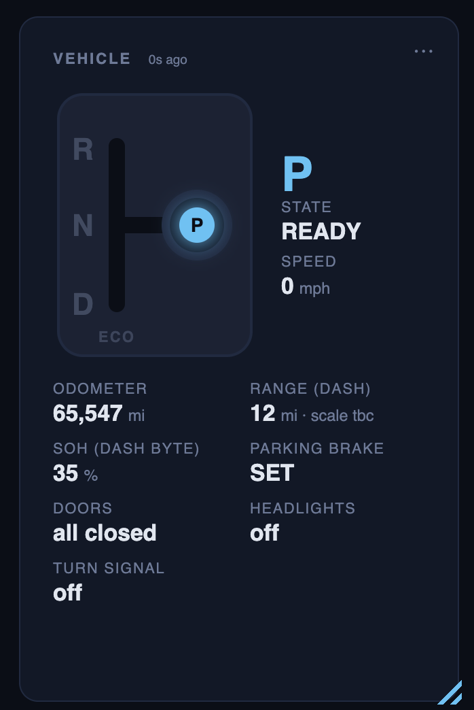

# Decoded signals

Everything the project knows how to read, where it comes from, and how sure
we are — one section per [vehicle profile](../vehicles/__init__.py).
**Verified** = observed changing with the physical input on this car.
**Static** = decoded from a static capture whose value passed an external check
(matches the dash, the LBC, or a plausibility bound) but has not been observed
changing. **Tentative** = from community documentation or an unchecked sample.

Sign convention: current is **negative while discharging**, positive while
charging/regenerating; `power_kw` uses the same sign. Temperatures are stored
in °C and always presented with °F.

Where a signal lives in code: the decode belongs to the profile
(`vehicles/<profile>.py`, the Leaf's byte work in `leaf_decoders.py`), the
label/unit/range in that profile's `SIGNALS`, and — if it is to be charted or
aggregated — a column in its `HISTORY_COLS`. See `ADDING_SIGNALS.md`.

## 2012 Nissan Leaf (ZE0)

### Transport facts (all adapters)

| Fact | Detail |
|---|---|
| Protocol | `ATSP6` — ISO 15765-4 CAN, 11-bit, 500 kbit/s (Car-CAN, OBD pins 6/14) |
| Standard OBD-II PIDs | Not implemented by the Leaf (`0100` → `NO DATA`) |
| UDS to the LBC | `ATSH 79B` / `ATCRA 7BB` / `ATCAF1` / `ATFCSH 79B` / `ATFCSD 30 00 20` (BLE; `30 00 05` over USB — probed 2026-09-09, the 29-frame cell answer intact at 5 ms and 0 ms, 1.18 s → 0.36 s) / `ATFCSM1` — the VCM bridges Car-CAN ↔ EV-CAN for these |
| Passive sniffing | **must use `ATCAF0`**; with `ATCAF1` most raw frames print as `<DATA ERROR` |
| Buffer | Unfiltered `ATMA` overflows (`BUFFER FULL`) within ~24 frames; always filter with `ATCRA` |
| EV-CAN (pins 12/13) | Not reachable with the standard 6/14 pinout — `0x1DB`, `0x55B`, `0x5BC`, `0x54C`, `0x54F` etc. are not visible; see "Not reachable without EV-CAN" for the re-pinned-cable route |
| BLE quirk | LELink needs `response=True` on every write or no notifications arrive |

### LBC / BMS — UDS `0x79B → 0x7BB`, service `0x21`

Offsets are 0-based into the payload after `61 NN`.

#### Group 01 — battery state (39 B) — verified

| Bytes | Field | Scale |
|---|---|---|
| 0–3 | HV current sensor 1 | s32 ÷ 1024 A |
| 6–9 | HV current sensor 2 | s32 ÷ 1024 A (**checked to −66 A on the 2026-09-03 drive**: it agrees with group 05 to a median 0.27 A below ±32 A and with group 05's aliased value above it, and coulomb-integrating it over the whole 964 s drive accounts for 96 % of the charge the BMS's own SOC × capacity says left the pack — the 4 % shortfall is the expected under-count from trapezoid integration of a spiky trace sampled every 5–6 s. `s32` has no ceiling and this drive found none) |
| 18–19 | **Pack voltage** | u16 ÷ 100 V (matches 96-cell sum within 0.1 V) |
| 20–21 | 12 V battery | u16 ÷ 1024 V |
| 22–23 | Insulation resistance | kΩ |
| 26–27 | HX | u16 ÷ 100 |
| 29–31 | SOC | u24 ÷ 10000 % |
| 33–35 | Capacity | u24 ÷ 10000 Ah (SOH = ÷ 66 Ah) |
| 4–5, 24–25 | unknown, static (`0x0287`, `0x00F2`) | — |

**Current-sensor behaviour (2026-08-24):** all three current sources — group-01
sensors 1 and 2 and group 05 — wander ±0.5 A around zero at idle, and the
group-05 discharge flag follows the noise; sensor 1 is coarse (±2 A steps).
Under a 500 W load sensor 2 and group 05 agree within 0.05 A. The reader fuses
sensor 2 (every cycle) with a learned offset to group 05 (every 5 s), applies
the per-car zero calibration, and clamps positive current while the BMS reports
discharging; the dashboard treats |I| < 0.6 A (|P| < 0.25 kW) as idle.

#### Group 02 — cell pair voltages (192 B of cell data; the ISO-TP parse pads to 200 B) — verified
96 × u16 mV, `0xFFFF` padding after the last cell. Polled every 20 s by
default (`ITEMS["lbc02"]`, ~1.3 s a read over BLE); the *cell log* tile option
moves it to every cycle and stores every read, for drive logs.

**The range a pair is expected to hold** is 3000 … 4200 mV: the bounds the
signal registry declares for `cell_min` and `cell_max`, and the bounds
`PACK_MODES` gives the *fixed range* colour scale (`docs/PACK3D.md`). They
are the design envelope, not a measurement — this car has been seen between
about 3.3 V under a hard pull and 4.1 V at rest near full. Nothing clamps a
stored reading to them; they only bound a colour, and a value outside them
paints at the end of the ramp.

##### Cell order in the pack — verified at the section level

The 3D pack tile places each of the 96 pairs in the car
(`PACK_LAYOUT` in `vehicles/leaf_ze0.py`, described in `docs/PACK3D.md`).
Pairs are numbered 1–96 on screen, the service manual's count (since
2026-09-08; before that the dashboard showed the 0-based list index, so a
"cell 53" in older worklog entries is pair 54 today). The record's `cells`
list, `cell_min_idx` / `cell_max_idx` and `PACK_LAYOUT`'s `first` are 0-based;
`cell_min_no` / `cell_max_no` carry the 1-based numbers for anyone — a person or
an agent reading the API — who wants the number the screen shows.

- **Verified — the ZE0 service manual, page EVB-20** (November 2010
  edition, April 2011 revision), as quoted by RegGuheert on mynissanleaf,
  2013-04-29, in "Which cell loses capacity fastest? Which retains it best?"
  (a 2011–2012 thread): *"Modules MD1 through MD24 are contained in a stack
  under the rear seat with MD1 on the far passenger's side and MD24 on the
  far driver's side. Modules MD25 through MD28 are located under the rear
  driver's side footwell. Modules MD29 through MD36 are located under the
  front driver's seat. Modules MD37 through MD44 are located under the front
  passenger's seat. Modules MD45 through MD48 are located under the rear
  passenger's side footwell."* Module n holds cells 2n−1 and 2n: rear stack
  pairs 1–48 passenger end → driver end, driver rear footwell 49–56, under
  the front driver seat 57–72, under the front passenger seat 73–88,
  passenger rear footwell 89–96.
- **Published:** 48 modules of 303 × 223 × 35 mm, 2s2p, in three sections
  (Wikipedia; Qnovo); the floor modules lie flat in "2-high packs of 4 and
  4-high packs of 8" per side (a 2013 pack teardown on summet.com), which
  with EVB-20 puts the 2-high stacks in the rear footwells and the 4-high
  stacks under the front seats. The LBC on the driver's side of the rear
  block (mynissanleaf).
- **Still assumed:** inside a footwell or seat group, which of its two stacks
  is rearmost and the bottom → top order within a stack (drawn so the string
  runs driver side rear → front, passenger side front → rear, bottom → top);
  and which half of a module carries the odd pair. Each `PACK_LAYOUT` row
  says what it assumes; the tile shows *(stack order assumed)* for those
  pairs. Settling it needs the EVB-20 figure itself or a look under the seat.
- **A conflicting secondary claim, noted and not followed:** a search-engine
  AI summary (September 2026, citing a YouTube repair video and a Facebook
  group) puts modules 25–36 on the passenger side and 37–48 on the driver
  side — the reverse — and calls the rear stack "double-stacked vertically",
  which every teardown contradicts. Two independent sources agree on the
  manual's order (the EVB-20 quote above and Arnis's 2016 diagram, "48 in
  the back, then 24 driver, then 24 passenger"), and it is the geometrically
  natural one: MD24 ends at the driver end of the rear stack beside the LBC,
  so MD25 in the driver's footwell is a short bus-bar hop, while the reverse
  would cross the pack. If a reader has the EVB-20 figure or has had the lid
  off, this is the row to check.
- The weakest pair was 54 in February and 56 in August (53 and 55 in the
  old 0-based count) — both in MD27/MD28 under the rear driver's footwell,
  next to the LBC.

#### Group 03 (32 B) — tentative
Bytes 10–11 cell max mV, 12–13 cell min mV. Rest unknown.

#### Group 04 — temperatures (18 B) — verified
4 × (u16 raw, s8 °C); byte 12 looks like the mean.

#### Group 05 — extended state (74 B) — verified
| Bytes | Field | Scale |
|---|---|---|
| 6–7 / 8–9 | cell max / min | mV |
| 10–17 | temperature raws (as group 04) | |
| 20–21 | discharge flag | `0xFFFF` = discharging |
| 22–23 | pack current | s16 ÷ 1024 A, **and it aliases**: the same count group 01 reports, truncated to 16 bits, so a true current outside ±32.0 A folds back by 64 A (resolved 2026-09-03; see below) |
| 24–25 | insulation | kΩ |
| 26–45 | segment deltas ×10 | u16, `0xFFFF` padding |
| 46–65 | cell-group voltages ×10 | u16 |

**Group-05 current wraps — resolved 2026-09-03.** The question raised on
2026-09-02 (a signed 16-bit field ÷ 1024 saturates at ±32.0 A, yet the car
draws far more than that) is answered by the 13-minute drive of
2026-09-03 21:45–21:59 UTC: 171 rows, 92 fresh group-05 samples, group-01
sensor 2 reaching −66.5 A. Of the four shapes the capture plan named — linear
past 32 A, wraps, clamps, or a wrong slope — **it wraps**. The scale is a
plain `s16 ÷ 1024`; there is simply no wider field and no clamp, so a true
current outside ±32 A comes back folded by 64 A, sign and all.

The evidence, comparing each fresh group-05 sample against group-01 sensor 2
(`lbc01` is period 0, `lbc05` period 5, so the two reads are ~0.5–1 s apart;
every hypothesis was allowed the same best-of-three choice among the
neighbouring sensor-2 reads):

| hypothesis | median error, samples above ±32 A (n = 21) |
|---|---|
| linear (group 05 = sensor 2) | 8.49 A |
| clamps at ±32 | 8.49 A |
| a different slope (half scale) | 11.88 A |
| **wraps (16-bit aliasing)** | **2.50 A** |

2.50 A is the measurement's own resolution, not a residual: in-band samples
taken under the same fast transients (>15 A of slew across the three-row
window) disagree by a median 1.80 A for purely timing reasons.

*Clamping is falsified outright.* Of the samples whose neighbourhood exceeded
40 A, **none** sat at the rail; only 4 of 169 samples fall in the 30–32 A bin
at all and the distribution of |current| is smooth right up to it. The
largest magnitude ever seen was 31.919 A, and the field changes sign as it
crosses the rail — at sensor-2 −34.11 A group 05 read **+31.71 A**, where a
clamp would give −32, linear −34 and a half scale −17. Two more, taken while
current was changing slowly: sensor 2 −47.50 A → group 05 +15.57 A (folded
+16.50); sensor 2 −41.13 A → +23.58 A (folded +22.87).

*Below the rail the published scale is right.* Restricted to fresh samples
where sensor 2 moved less than 3 A across the three-row window (n = 25,
|I| ≤ 30 A), group 05 and sensor 2 agree to a median 0.27 A, worst case
1.43 A, with a fit of `g05 = 0.956·s2 − 0.199` (R² = 0.995 — a consistency
check between two reads of one quantity, not a calibration).

**What this means for the reader.** `apply_policy()` treats group-01 sensor 2
as canonical, which is the right choice and needs no change. But it also
learns `s2_offset = group05 − sensor2` on every fresh group-05 sample and
carries it between samples — and above ±32 A that difference *is* the wrap
error. Over this drive the fused `current_a` strays from sensor 2 by a median
5.9 A, p90 23.6 A, worst 41.1 A while moving; the `discharging and cur > 0 →
0.0` clamp then zeroes many driving rows outright. The offset should only be
learned while |group 05| is comfortably inside the band and the two reads are
close. Fixed 2026-09-03 (the learn band and delta limit in `apply_policy`).

**Stored values are the reported values (2026-09-09).** `apply_policy()` no
longer rewrites `current_a` or `power_kw`: they stay exactly what `decode()`
produced (sensor 2 when group 01 was read, else group 05; power from that and
`pack_v`) and that is what the database keeps. Everything the policy derives —
the fusion offset, the zero calibration, the positive-while-discharging clamp —
lands in `current_adj_a` / `power_adj_kw`, with `current_adj_src` naming the
steps (`s2+g05_offset+zero_cal+clamp`). The policy also publishes its working:
`current_raw_a` (an alias of the reported value), `current_fused`,
`s2_offset_a`, `s2_offset_stale` and `current_offset_a`, and it sets
`discharging` only when `decode()` did not, and the power tile shows the adjusted
value with a *display-only* smoothing chosen in its ⋯ menu. A profile's policy
may add keys; it may never change a reported one (`tests/test_policy_raw.py`).

Also open, from the same drive: group-01 sensor 1 reads a median **1.358×**
sensor 2 under load (p10 1.294, p90 1.429, n = 48 above 15 A), and it is
sensor 2 that coulomb-counts correctly against SOC. Sensor 1 is not simply
"coarse"; its scale or its meaning is wrong. Unresolved.

Related, from the earlier capture: group 05's cell max/min (3965/3953 mV) disagree with
group 02's (4011/3981 mV) in `tests/fixtures/lbc_raw_20260824.json`. Either
they are sampled at different instants or one pair is a different field.
Unresolved; group 02 is the one the dashboard uses.

#### Group 06 — balancing (25 B) — tentative
24 data bytes = 192 bits = 2 bits per cell pair; non-zero appears to mean the
pair is being bled. Needs a charge session to confirm.

### HVAC amplifier — UDS `0x744 → 0x764`, service `0x21`

Full service-21 sweep (2026-08-24): only **00** (4 B `80 01 80 00`), **01**, **10**, **11**, **82** (DTC-style, mostly `FF`) and **83** (ASCII part number) answer; everything else → NRC `0x12`; service `0x22` → NRC `0x11`. Intake (fresh/recirc) walks moved nothing in 10/11/01 — the intake door is not exposed there.

#### Group 10 (41 B declared; the parse pads to 46 B) — tentative
| Byte | Field | Scale | Sample (AC on, evening) |
|---|---|---|---|
| 0 | ambient | raw − 40 °C | 33 °C / 91 °F |
| 1 | **in-car (cabin)** | raw − 40 °C | 21 °C / 70 °F |
| 2 | intake / evaporator | raw − 40 °C | 1 °C / 34 °F |
| 3 | sunload | raw | 2 |
| **10** | **bit 7 = A/C compressor on** | `00` ↔ `80` | **verified** (A/C walk off/on/off/on/off) |
| **11** | **blower: bit 7 = HVAC/fan on, bits 0–6 = motor volts** | fan 1–7 → 4 5 6 8 9 11 **11** V; HVAC OFF → `00` | **verified** (fan walk 1→7→1, on/off walk). Speeds 6 and 7 both read 11 V — indistinguishable here (the decoder's 12 V → speed-7 slot has never been observed on this car); the tile shows "6–7" |
| **12** | **air-mix target ≈ setpoint**: °F ≈ 60 + (raw − 111) × 30/62 | 111…173 for 60…90 °F, 1–3 counts lag coming down | verified proxy (setpoint walk 60→90→60) |
| 21–22 | compressor speed, u16 rpm | 1600–2425 with A/C on, 0 off | tentative |
| 23–26 | two u16 words (`hvac_w23`, `hvac_w25`) that scale with compressor rpm (power / current?) | | unresolved |
| 29, 31 | non-zero only while heating (`18 00 03` at 90 °F) — heater A / kW candidates | | unresolved |
| **36** | **heater demand level** | 0 at 60–65 °F, 3 → 40 as the PTC works | tentative |
| 38, 39 | `00` HVAC off · `36` on · `64`–`6E` after A/C or defrost | | unresolved |

**Not readable from this ECU (walked, nothing moved in 00/01/10/11):** vent
mode (4-position cycle, twice), AUTO, fresh/recirc. OVMS reads those from
EV-CAN `0x54B` (fan, vent mode, intake) — needs the re-pinned cable.

Group 11 (11 B) and group 00 (11 B) are captured raw; not yet decoded.

### Car-CAN passive frames (capture with `ATCAF0` + `ATCRA <id>`)

| ID | Bytes | Field | Decode | Status |
|---|---|---|---|---|
| `0x421` | b0 | **Gear** | `08` P · `10` R · `18` N · `20` D · `38` Eco | **verified** (all five, 2026-08-24) |
| `0x174` | b3 | Gear (coarse) | `AA` P/N · `99` R · `BB` D/Eco | verified — cannot split P/N or D/Eco; not polled (`0x421` is used) |
| `0x358` | b2 | **Turn signals** | `80` off · `82` left · `84` right · `86` hazards | left/right **verified** (2026-02 capture); `86` hazards tentative — community value, never captured on this car |
| `0x385` | b2–5 | **TPMS** | psi = raw ÷ 4, order FL FR RR RL | static — plausible pressures; < 5 psi = sensors asleep |
| `0x5C5` | b1–3 | **Odometer** | u24 in dash units (see `0x355`) | static — matches the dash (65,545 mi) |
| `0x5C5` | b0 bit 2 | Parking brake | | static (only 'set' observed) |
| `0x355` | b6 bit 5 | Units | 1 = miles | static |
| `0x5B3` | b1 | **SOH (dash)** | (b1 >> 1) % | static — matches the LBC (35 %) |
| `0x60D` | b0 | **Doors (per corner)** | `08` driver · `10` passenger · `20` rear-L · `40` rear-R · `80` hatch · bit1 headlights | **verified** (door walk 2026-08-25) |
| `0x60D` | b2 | **Locks** | `18` locked · `00` unlocked | **verified** (lock walk) |
| `0x60D` | b1 bits 1–2 | Start state | 0 off · 1 acc · 2 on · 3 ready (`06`→ready) | tentative |
| `0x284` | b4–5 | Speed | ≈ raw ÷ 100 km/h | tentative (only 0 observed) |
| `0x5A9` | b1–2 | Range (guess-o-meter) | (u16 >> 4) ÷ 5 km | tentative — scale unconfirmed |
| `0x180` | b5 | Throttle | ÷ 2 % | tentative; decoded but not yet polled by the reader |
| `0x292` | b6 | **Brake pedal / brake light** | `brake_on` = b6 > 0 | tentative |
| `0x60D` | b0 | **Lights:** `0x04` parking · `0x02` low beam | | **verified** (lights walk 2026-08-25) |
| `0x60D` | b1 | **Lights:** `0x08` high beam · `0x01` fog | (bits 1-2 are start-state) | **verified** |
| `0x625` | b1 | Light-level bitfield: `0x40` park · `0x20` low · `0x10` high · `0x08` fog | mirrors 0x60D | observed in walks; not decoded — the dashboard uses `0x60D` |
| — | — | Reverse lights | derived from gear = R (`0x421`) | derived |
| — | — | Turn / side repeaters / hazards | driven by `0x358` (front+rear+side, same side) | left/right verified; hazards tentative |
| `0x260` | — | Available power (53 kW drive / 5 kW regen) | | observed 2026-02 |
| `0x1D5` | — | Torque | | observed 2026-02 |

### Other ECU probes

| ECU | Address | Result |
|---|---|---|
| VCM | `0x797 → 0x79A` | NRC `0x80` for every `0x21`/`0x22`; `0x1A`/`0x09` → NRC `0x11`. Needs a CONSULT session / security access. Parked. |
| Inverter | `0x793 → 0x7BD` | no response |
| Steering | `0x746 → 0x766` | no response |
| ABS, BCM, EPS | `0x743`, `0x745`, `0x784` | respond to group 01; not yet decoded |

### Not reachable without EV-CAN

**EV-CAN is on the OBD-II port of the 2011–2017 Leaf** (confirmed against the
OVMS ZE0 cable pinout and the sethfischer Leaf OBD manual, 2026-08-25):

| OBD-II pin | Signal |
|---|---|
| 6 / 14 | Car-CAN H / L (what every ELM327 uses) |
| **13 / 12** | **EV-CAN H / L** |
| 11 / 3 | AV-CAN H / L |
| 4, 5 | chassis / signal ground |
| 8 | +12 V only when the vehicle is powered on |
| 16 | permanent +12 V |

OVMS's ZE0 cable (SKU 1779000) wires OBD 13 → DB9 7 (CAN-H) and OBD 12 → DB9 2
(CAN-L) as its *primary* bus and 6/14 as the alternate — i.e. it is exactly
the 12/13 ↔ 6/14 swap. Only the 2018+ ZE1 has a gateway isolating the port.
So a re-pinned OBD extension (female 6 ← plug 13, female 14 ← plug 12) puts
an ELM327 on EV-CAN and would expose, per OVMS:
`0x1DB` pack V/I at 10 ms, `0x1DA` motor torque/RPM, `0x1DC` power limits,
`0x55B` SOC, `0x5BC` GIDs, `0x54C` ambient, `0x54F` cabin, `0x55A` motor and
inverter temps, `0x5C0` battery temp, `0x380`/`0x5BF` charger status,
`0x11A` gear + eco.

**EV-CAN, simulated only (ASSERTED, 2026-09-09).** The simulated CAN rig
(`simulator/canbus.py`, `--adapter sim --sim-can ev`) emits seven of those
ids so the multi-bus transport has something to listen to before the cable
exists. Every byte is transcribed from public documentation and none has
been seen on this car; the encoders and their decoders live in the
simulator, not in `leaf_decoders.py`, on purpose. Source per id, as quoted in
each encoder's docstring: `0x1DB` current 11-bit s two's complement × 0.5 A
(bits 7|11@0, discharge negative — the DBC's [−400|200] range; OVMS negates
for its own convention) and voltage 10-bit × 0.5 V (23|10@0), relay /
full-charge / interlock flags — dalathegreat `EV-can_ZE0.dbc` + OVMS
`vehicle_nissanleaf.cpp` case `0x1db`; `0x1DA` torque 11-bit × 0.5 Nm
(18|11@0) and rpm 15-bit (39|15@0), both signed per OVMS where the ZE0 DBC
says unsigned, bytes 0–1 DC-bus volts × 2 per 8dromeda; `0x1D4` torque
request 12-bit × 0.25 Nm (23|12@0, signed per the AZE0 DBC and 8dromeda),
byte 6 bit 7 charge running (OVMS); `0x55B` SOC 10-bit × 0.1 % (7|10@0,
0x3FF invalid, OVMS); `0x5BC` gids 10-bit (7|10@0), full Wh (13|10@0,
×80 + 250), bars mux, average temperature (byte 3 − 40), byte 4 bits 1–7 as
SOH % (the DBC calls it `LB_Capacity_Deterioration_Rate`; the community reads
it as SOH), minutes-to-full 13-bit (52|13@0, 8190 = none); `0x11A` gear
nibble (4|4@1; P=1 R=2 N=3 D=4 is a community ordering, no value table in
the DBC), Eco bit 12, car-on bits 13–15 (enum asserted); `0x1DC` discharge /
charge limits 10-bit × 0.25 kW (7|10@0, 13|10@0), charger max 10-bit × 0.1 kW
− 10 (19|10@0; OVMS drops the offset). The last byte of `1DB`/`1DA`/`1D4`/
`55B`/`1DC` is CRC-8 poly 0x85 on the community's word. The comparison that
will test all of this against the car is `tools/compare_sessions.py`.

## 2009 Mitsubishi Lancer ES

Standard SAE J1979 mode-01 — no reverse engineering, so every PID here is
public spec, not a discovery. "Verified" below means observed on this car's
real idle/DTC captures, not that the spec itself was in doubt.

### Transport facts

| Fact | Detail |
|---|---|
| Protocol | `ATSP6` — ISO 15765-4 CAN, 11-bit, 500 kbit/s |
| Engine ECU | `0x7E0 → 0x7E8`, mode 01 (39 PIDs supported by this ECU) |
| Transmission ECU | `0x7E1 → 0x7E9`, mode 01 / mode 03 |
| DTC modes | `01` (MIL + count), `03` (stored), `07` (pending) — **read-only; mode `04` (clear) is never sent** |
| Multi-frame DTC reads | functional addressing (`7DF`) cannot do ISO-TP flow control, so a 12-code mode-03 answer needs physically-addressed requests (`7E0/7E8` + `ATFCSH`/`ATFCSD`/`ATFCSM1`) |

### Live PIDs (`tests/fixtures/lancer_idle_raw_20260828.json`) — verified

| PID | Field | Scale | Sample (idle, 2026-08-28) |
|---|---|---|---|
| `0105` | Coolant temp | raw − 40 °C | 203 °F |
| `0142` | 12 V module voltage | u16 ÷ 1000 V | 13.84 V (charging) |
| `010C` | Engine RPM | (256·b0 + b1) ÷ 4 | 719 rpm |
| `010D` | Vehicle speed | raw km/h | 0 |
| `0104` | Engine load | raw ÷ 255 × 100 % | — |
| `0111` | Throttle | raw ÷ 255 × 100 % | — |
| `0110` | MAF airflow | (256·b0 + b1) ÷ 100 g/s | — |
| `010B` | Manifold pressure | raw kPa | — |
| `010E` | Timing advance | raw ÷ 2 − 64 ° | — |
| `010F` | Intake air temp | raw − 40 °C | — |
| `0146` | Ambient temp | raw − 40 °C | ~61 °C at idle — **engine-bay heat soak, not weather; don't trust as outdoor temp on a stationary car** |
| `012F` | Fuel level | raw ÷ 255 × 100 % | — |
| `0103` | Fuel system status | bitmask → text | — |
| `011F` | Run time since start | 256·b0 + b1 s | — |
| `0133` | Barometric pressure | raw kPa | — |

### DTC readout (`tests/fixtures/lancer_dtc_raw_20260828.json`) — verified 2026-08-28

| Source | Field |
|---|---|
| `0101` | MIL on/off (bit 7) + stored count (bits 0–6) |
| `03` via `7E0/7E8` | Stored engine codes |
| `07` via `7E0/7E8` | Pending engine codes |
| `03` via `7E1/7E9` | Stored transmission codes |

This car's actual codes at capture time: MIL ON, 12 stored engine codes +
1 CVT code — `P0131`/`P0132`/`P0134`/`P2195`/`P0171` (upstream O2, and the
only ones also **pending**, i.e. the live fault), `P0122`/`P0223` +
`P1233`/`P1234`/`P1235` (electronic-throttle plausibility cluster),
`P1590` (CVT↔ECM torque-request comms), `P0868` (CVT secondary pressure).
See the 2026-08-28 WORKLOG entry for interpretation.

## Record keys every vehicle carries — time and provenance (2026-09-09)

Not decoded from any byte; the reader stamps them on every record and row.
`docs/TIMING.md` is the authority.

| Key | Where | Meaning | Status |
|---|---|---|---|
| `timing[item]`, `item_age[item]` | record, `extra` | request duration; seconds since the item last ran at emission (monotonic) | in use since the scheduler |
| `item_ts[item]` (ISO ms), `item_ts_epoch[item]` | record; `extra` keeps the epoch, playback rebuilds the ISO | when the item's value was acquired — a UDS answer as it returned, a passive item by its newest frame's arrival | test-verified |
| `frame_ts[item]` | record, `extra` | the source's own timestamp of the newest frame behind a passive item; only on the native CAN / MQTT façade | test-verified in-process; no hardware yet |
| `ts_source` | record, its own `readings` column | whose clock the row's time is: `laptop` \| `driver` \| `bridge`; NULL on rows from before the column | test-verified |
| `clock_offset_s` | record, `sessions.clock_offset_s` | `median(t_rx − t_src)` over the last frames; absent on an ELM; never applied to a stored value | test-verified in-process |
| `<key>_min`, `<key>_max`, `<key>_tmin`, `<key>_tmax`, `<key>_n` | stored row's `extra` only | the envelope of a `peak: True` key since the previous row (Leaf: `pack_v`, `current_a`, `power_kw`, `cell_min`); reset on every row | test-verified |
| `adapters`, `bus_alive` | record, `extra`; `sessions.adapters` | one entry per bus ({bus, type, name, port, listen_only, speed, connected, alive, …}); the tri-state liveness per bus. The old `adapter_*` keys are the primary bus's | test-verified with fake transports; two real adapters not yet run |
| `<key>_src`, `<key>_resolved`, `<key>_disagree` | record, `extra` | for a `SIGNALS` entry with `sources`: which source the resolver chose (`"bus:item"` or `"stale"`), its value when a decoder owns `<key>` itself, and `{a, b, delta}` when two fresh sources differ by more than `tolerance` (also a `source_disagree` event). Leaf: `current_a` from `hv_current2_a` (lbc01) and `g05_current_a` (lbc05), tolerance 3 A — expect disagreements while driving above ±32 A, where group 05 wraps | test-verified |

## Credits

The Leaf CAN IDs, byte offsets and scalings above were cross-checked against
two community projects:

- Open Vehicle Monitoring System — `vehicle_nissanleaf.cpp` (CAN ID map,
  scalings). MIT, verified 2026-09-02.
- dalathegreat — `leaf_can_bus_messages` (DBC collection). GPL-3.0, verified
  2026-09-02.

**No code from either project is in Ha-Kake.** Every decoder here was written
from scratch against captures from the owner's own car, and every signal was
re-verified on that car before being marked verified above; what was taken from
those projects is *facts* about how the vehicle behaves, not expression. Their
licenses are recorded in [`NOTICE`](../NOTICE) — read that for the full
attribution and reasoning rather than relying on this summary.

Every capture in `tests/fixtures/` was taken on the author's own 2012 Leaf and
2009 Lancer.
